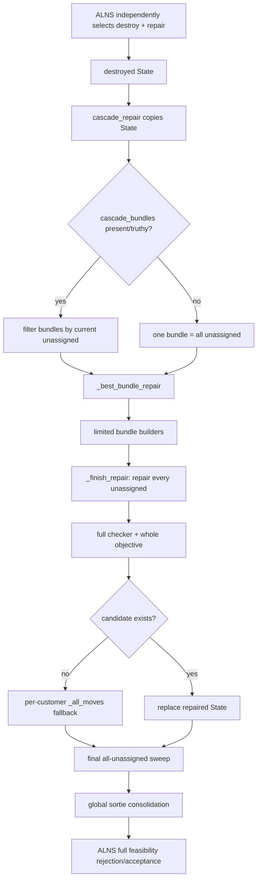

# Current code call graph

## Public bindings and ALNS invocation

- Removal: `operators.py:225 cascade_aware_removal`
- Repair: `operators.py:2599 cascade_repair`
- Registry bindings:
  - `DESTROY_OPERATORS["cascade_aware_removal"]`
  - `REPAIR_OPERATORS["cascade_repair"]`
- ALNS selects destroy and repair independently from their complete registries at `alns_solver.py:138-147`. There is no enforced Cascade-removal/Cascade-repair pairing.
- Current registries contain 7 destroy and 5 repair operators, whereas the paper's Section 5.2.2 describes a 4-by-4 action space. Registry correction is outside this audit and was not performed.

## Complete current Cascade repair path

```text
alns_solver.solve
  -> independently select destroy_name and repair_name
  -> DESTROY_OPERATORS[destroy_name](current.copy(), ...)
  -> REPAIR_OPERATORS[repair_name](destroyed, ...)
     -> cascade_repair
        -> state.copy()
        -> metadata["cascade_bundles"]
           OR fallback [all current unassigned]
        -> for each filtered bundle
           -> _best_bundle_repair
              -> _repair_bundle_all_van
                 -> _best_van_move -> hard-feasibility helpers
              -> _repair_bundle_best_modes
                 -> _all_moves
                    -> _best_van_move
                    -> _best_drone_move
                       -> _extend_drone_customers
                       -> _best_drone_move_for_customers
              -> _repair_bundle_as_drone
                 -> _best_drone_move_for_customers
              -> _repair_bundle_partial_candidates (only size 2-3)
                 -> combinations
                 -> _best_drone_move_for_customers + _best_van_move
              -> for every candidate: _finish_repair
                 -> while all state.unassigned and progress
                 -> _all_moves for every remaining customer
              -> _candidate_score
                 -> check_solution_feasible (requires whole State feasible)
                 -> objective (whole State)
              -> minimum whole-State objective candidate
           -> if no candidate: per-customer _all_moves fallback on bundle
        -> final ordered loop over all remaining state.unassigned
           -> _all_moves
        -> _finalize_repair
           -> consolidate_drone_sorties over the whole feasible State
              -> global sortie-group merging and full feasibility/objective checks
  -> objective(candidate)
  -> reject candidate when full feasibility is false
```

## Explicit non-calls

`cascade_repair` does not call the public `best_mode_repair`, `greedy_van_repair`, `greedy_drone_repair`, or `regret_repair` functions. It does, however, reuse `_all_moves`, `_best_van_move`, `_best_drone_move`, and `_best_drone_move_for_customers`, so its fallback behavior is generic best-mode/per-customer generation.

## Mermaid view


