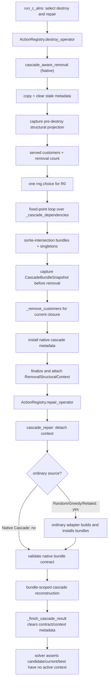

# Current Native Cascade Call Graph

## Runtime path

## Native selection and closure

`operators.cascade_aware_removal` (`operators.py:713`) copies the input State, clears stale cascade metadata/context, captures a pre-destroy projection, and computes the served list as the sorted union of van- and drone-served customers. The requested seed-set size is `max(1, round(total_customers * customer_removal_ratio))`, capped by the served count. If served customers exist, exactly one call is made:

`rng.choice(served, size=count, replace=False)`.

The returned list is `initial`; `removal = set(initial)`. The function repeatedly visits `list(removal)`, calls `_cascade_dependencies` for each member, unions newly discovered dependencies, and stops at set stability. Only newly discovered `(source, dependency)` edges are retained in the structural context trace.

`_cascade_dependencies` (`operators.py:448`) starts with the customer itself. For every drone sortie containing that customer as launch, recovery, or sortie customer, it adds every drone customer and adds launch/recovery unless the node is in `metadata["route_endpoints"]`. It does not inspect van-route adjacency, downstream receiving-route customers, container/warehouse decisions, truck routes, carrier transfer across successive sorties, or general coordination facts.

## Native bundle construction and removal

For each drone sortie in State order, the function builds `related = drone_customers + customer-valued launch/recovery`, intersects it with the closure, sorts the result, and appends a bundle when non-empty. Closure customers not marked assigned are appended as sorted singleton bundles. The construction does not subtract previously assigned members when processing a later sortie; overlap is therefore possible in a shared-anchor/shared-customer structure, although `_validated_cascade_bundles` later rejects overlap.

`_capture_cascade_bundle_snapshot` captures service, route-segment, drone-sub-route, launch/recovery, carrier-transfer, truck/warehouse, and affected-scope facts from the pre-removal State. It sets `dependency_order = customer_ids` and explicitly labels the order “current implementation order; Paper unspecified.” No RNG is used.

The closure is passed as a Python set to `_remove_customers`. `_remove_customer` removes the customer from van routes; if it is a sortie customer or launch/recovery node, it removes the whole sortie and marks all sortie customers unassigned. Duplicate unassigned customers are then removed. Native contract metadata and an immutable `RemovalStructuralContext` are attached afterward.

## Destroy-to-repair boundary

`run_c_alns` calls destroy and repair with the same RNG. `cascade_repair` directly detaches the active removal context. Only contexts whose source is Random, Greedy, or Related enter `adapt_removal_context_to_cascade_bundles`; a Native Cascade context bypasses that adapter. Native metadata is validated against the exact destroyed-state fingerprint and the non-overlapping bundle union before reconstruction.

Global, Local, and Regret repairs are decorated with `removal_context_boundary`, which detaches/discards the context and never returns it. Cascade repair has its own explicit detach/finally cleanup. The solver checks that current, best, and repair-returned candidate States carry no active context. These mechanisms are infrastructure rather than paper removal semantics.

## Classification

- Native Cascade algorithm: `cascade_aware_removal`, `_cascade_dependencies`, fixed-point loop, Native partition, snapshot creation, actual customer removal.
- Ordinary adapter only: `_atomic_edges`, `_partition_and_order`, `adapt_removal_context_to_cascade_bundles`, `install_adapted_cascade_contract`; none is called by Native Cascade removal.
- Shared infrastructure: structural projection/context functions, bundle validators, lifecycle guards, action registry.
- Repair-side and out of Stage 2F.0 implementation scope: bundle reconstruction strategy enumeration/scoring and all non-Cascade repairs.

